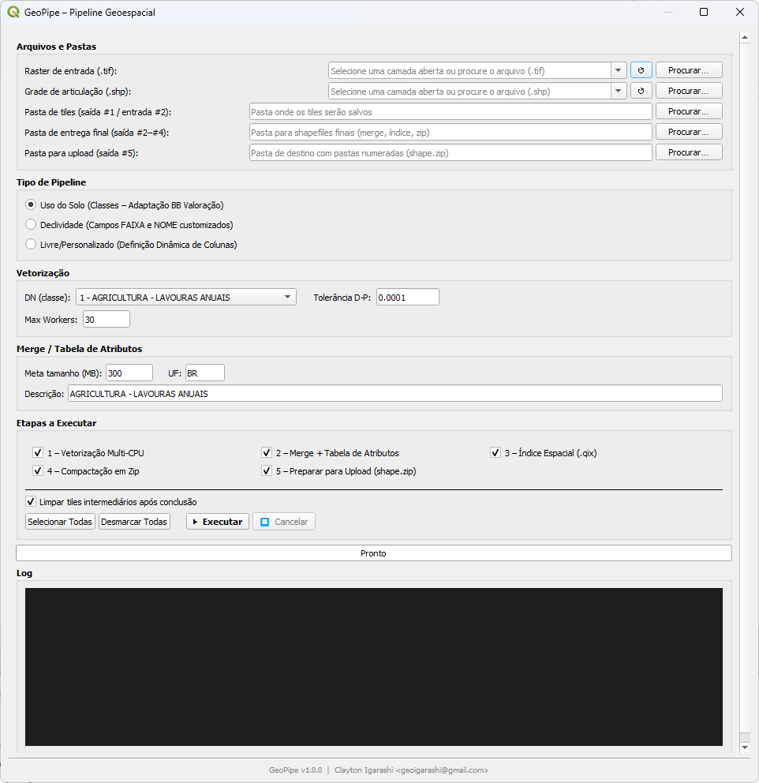
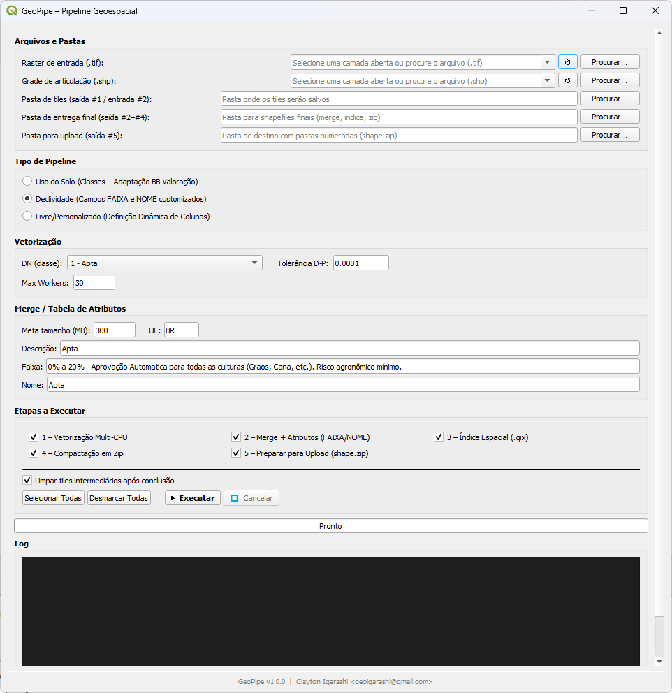
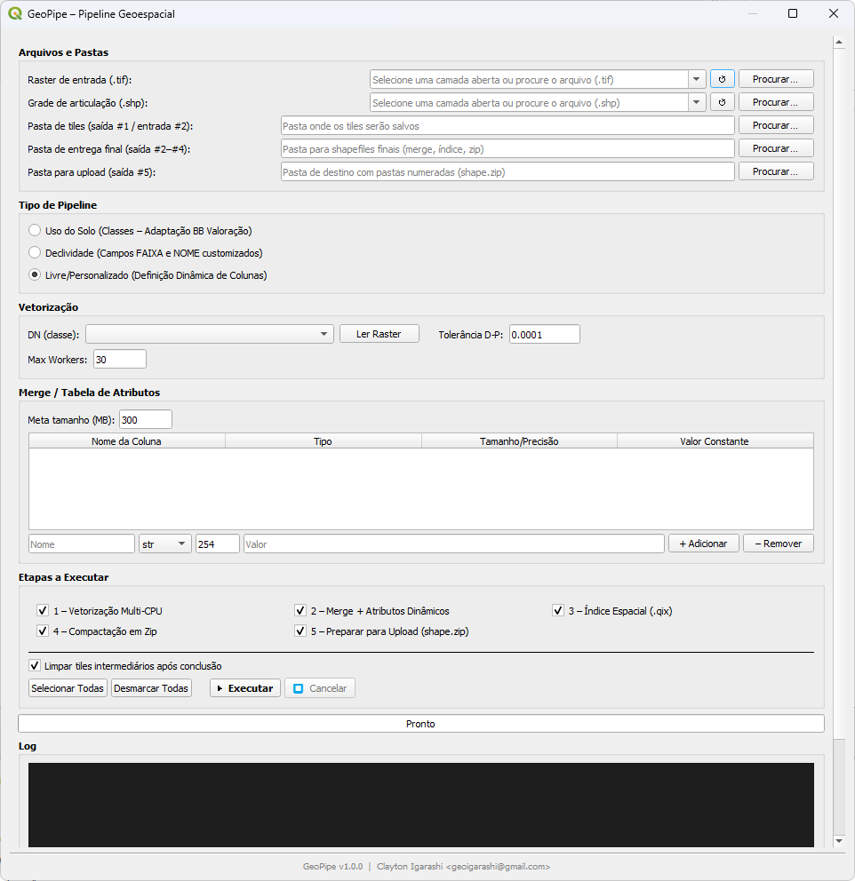

# GeoPipe – Pipeline Geoespacial para QGIS

Plugin QGIS para execução automatizada do pipeline completo de vetorização multi-CPU, merge com tabela de atributos, criação de índice espacial, compactação e preparação de shapefiles para upload.

---

## Screenshots

| Modo Uso do Solo | Modo Declividade | Modo Livre/Personalizado |
|---|---|---|
|  |  |  |

---

## Funcionalidades

- **3 modos de pipeline** configuráveis na interface:
  - **Uso do Solo** — classes DN com adaptação BB Valoração (agricultura, pastagem, silvicultura, etc.)
  - **Declividade** — campos FAIXA e NOME customizados por faixa de declividade
  - **Livre/Personalizado** — definição dinâmica de colunas com nome, tipo, tamanho e valor constante (com validação estrita de 10 caracteres para compatibilidade DBF/Shapefile)

- **Leitura dinâmica e segura de classes do raster** — botão "Ler Raster" executa a extração de classes assincronamente em `QgsTask` em segundo plano, com barra de progresso, filtragem correta de NoData/NaN e proteção contra rasters contínuos

- **Seleção de camadas abertas** — raster de entrada e grade de articulação podem ser escolhidos diretamente das camadas carregadas no projeto QGIS, ou buscados pelo sistema de arquivos

- **Pré-filtro espacial inteligente** — a grade de articulação é filtrada espacialmente pelo bounding box do raster antes do processamento, evitando o despacho desnecessário de milhares de tiles fora da área de estudo

- **Execução em background multi-CPU** — pipeline roda em `QgsTask` (thread segura), mantendo o QGIS responsivo durante todo o processamento; detecção dinâmica do número de workers recomendados

- **Cancelamento seguro de processos** — encerra imediatamente toda a árvore de subprocessos no Windows (`taskkill /F /T`), evitando processos zumbis consumindo CPU

- **Merge de alta performance** — análise e particionamento de polígonos que excedem o limite de 450k vértices de forma vetorizada em C (`shapely.get_num_coordinates`), eliminando gargalos de memória e CPU

- **Log em tempo real** — cada linha de saída dos scripts é exibida imediatamente no painel de log (sem agrupamento em lotes); gerado também em arquivo a cada execução: `pipeline_YYYYMMDD_HHMMSS.log`

- **Validação de caminhos** — verifica existência de arquivos e pastas antes de iniciar; oferece criação automática de pastas faltantes

- **Carga automática de resultado** — ao concluir com sucesso, carrega o shapefile resultante diretamente no mapa do QGIS (suporta leitura de `shape.zip` via `/vsizip/` sem extração)

- **Reprojeção automática de CRS** — se a grade de articulação estiver em sistema de coordenadas diferente do raster, é reprojetada automaticamente antes da vetorização (comparação semântica via pyproj, não por string)

- **Tooltips contextuais** — ao passar o cursor sobre os campos principais (raster, grade, pastas, modo de pipeline, DN, tolerância D-P, workers, tamanho alvo), uma dica explicativa é exibida

- **Persistência de configurações** — todos os campos (caminhos, parâmetros, etapas selecionadas, opções de limpeza e preservação) são restaurados automaticamente entre sessões via `QSettings`

- **Limpeza e preservação configuráveis** — opções independentes para remover tiles intermediários e para preservar shapefiles descompactados após a compactação em ZIP

- **Padronização para upload** — organização automática em pastas numeradas sequencialmente com 3 dígitos (`001/shape.zip`, `002/shape.zip`, ...)

---

## Etapas do Pipeline

| # | Script | Descrição |
|---|---|---|
| 1 | `vetorize_multicpu.py` | Vetorização multi-CPU com Douglas-Peucker |
| 2 | `merge_with_attributes.py` / `merge_custom_attrs.py` / `merge_dynamic_attrs.py` | Merge dos tiles + tabela de atributos |
| 3 | `create_spatial_index.py` | Criação de índice espacial `.qix` |
| 4 | `compress_shapefiles.py` | Compactação em ZIP |
| 5 | `prepare_for_upload.py` | Padronização em pastas numeradas com `shape.zip` |

Cada etapa pode ser ativada/desativada individualmente antes da execução.

---

## Requisitos

### QGIS
- QGIS ≥ 3.16 (LTR recomendado)
- Instalação via OSGeo4W

### Python (ambiente OSGeo4W)
As dependências abaixo devem estar instaladas no **Python do QGIS** (`OSGeo4W\bin\python.exe`), não no Python do sistema:

```
fiona
rasterio
geopandas
shapely
pandas
numpy
pyogrio
```

Para instalar via OSGeo4W Shell:
```bash
pip install fiona rasterio geopandas shapely pandas numpy pyogrio
```

---

## Instalação

### Opção 1 — Instalar pelo ZIP (recomendado)

1. Faça o download do repositório como `.zip` (`Code → Download ZIP`)
2. No QGIS: **Plugins → Gerenciar e Instalar Plugins → Instalar a partir de um ZIP**
3. Selecione o arquivo baixado e clique em **Instalar Plugin**

### Opção 2 — Instalação manual

1. Clone ou baixe este repositório
2. Copie a pasta `geopipe_qgis/` para o diretório de plugins do QGIS:
   ```
   %APPDATA%\QGIS\QGIS3\profiles\default\python\plugins\
   ```
3. Reinicie o QGIS
4. Ative o plugin em **Plugins → Gerenciar e Instalar Plugins → Instalados**

---

## Como Usar

1. Abra o plugin pelo menu **GeoPipe** ou pelo ícone na barra de ferramentas
2. **Arquivos e Pastas** — selecione o raster de entrada e a grade de articulação (camadas abertas no QGIS ou arquivos no disco) e defina as pastas de saída
3. **Tipo de Pipeline** — escolha o modo adequado ao seu dado
4. **Vetorização** — selecione a classe DN e ajuste os parâmetros (passe o cursor sobre os campos para ver dicas explicativas)
5. **Merge / Tabela de Atributos** — preencha os atributos conforme o modo selecionado
6. **Etapas a Executar** — marque as etapas desejadas (a seleção é lembrada entre sessões)
7. Clique em **▶ Executar**

O log de execução é exibido em tempo real na seção **Log** e salvo em arquivo na pasta de upload. Use o botão **Abrir Log** para inspecionar o arquivo gerado.

---

## Estrutura do Projeto

```
geopipe_qgis/
├── __init__.py              # classFactory → instancia GeoPipePlugin
├── metadata.txt             # metadados do Plugin Manager do QGIS
├── geopipe_plugin.py        # registra botão/ação no menu e toolbar
├── geopipe_dialog.py        # diálogo principal (PyQt5) + PipelineTask (QgsTask)
├── icon.png                 # ícone do plugin
├── docs/                    # screenshots e documentação
└── scripts/                 # scripts do pipeline (chamados via subprocess)
    ├── vetorize_multicpu.py
    ├── merge_with_attributes.py
    ├── merge_custom_attrs.py
    ├── merge_dynamic_attrs.py
    ├── create_spatial_index.py
    ├── compress_shapefiles.py
    └── prepare_for_upload.py
```

---

## Notas Técnicas

- Os scripts são chamados via `subprocess.Popen` com variáveis de ambiente `PIPE_*`
- O executável `python.exe` é localizado automaticamente no ambiente OSGeo4W (não usa `sys.executable`, que no QGIS aponta para `qgis-ltr.exe`)
- O flag `-u` é passado ao Python ao chamar cada script, garantindo saída stdout sem buffer — o log é exibido linha a linha, sem agrupamento em lotes
- No Windows, `CREATE_NO_WINDOW` é aplicado ao subprocesso para suprimir janelas de terminal durante a execução
- A reprojeção da grade é feita em memória antes do lançamento dos workers, usando `geopandas.to_crs()` com comparação de CRS via `pyproj.CRS.equals()` (semanticamente correta, não por comparação de string)
- A leitura de shapefiles dentro de `.zip` após o upload é feita via `/vsizip/` (GDAL nativo), sem extração de arquivos
- Configurações persistidas via `QSettings("GeoPipe", "GeoPipePlugin")`: caminhos, parâmetros, modo, DN, etapas selecionadas e opção de limpeza

---

## Histórico de Versões

### 1.1.0
- **Fix** — janela de terminal não aparece mais durante a execução de cada etapa (`CREATE_NO_WINDOW`)
- **Fix** — log exibido linha a linha em tempo real (flag `-u` no subprocesso + migração para `QPlainTextEdit`)
- **Fix** — estado dos checkboxes de etapas e da opção "Limpar tiles" agora persistido entre sessões
- **Feature** — reprojeção automática da grade quando o CRS difere do raster
- **UX** — tooltips em 11 campos da interface
- **UX** — default Max Workers reduzido de 30 para 14

### 1.0.0
- Lançamento inicial

---

## Autor

**Clayton Igarashi** — [geoigarashi@gmail.com](mailto:geoigarashi@gmail.com)

Repositório: [https://github.com/geoigarashi/geopipe_qgis](https://github.com/geoigarashi/geopipe_qgis)

---

## Licença

Este projeto é distribuído sob a licença [GNU GPL v2](https://www.gnu.org/licenses/old-licenses/gpl-2.0.html), em conformidade com os requisitos de plugins QGIS.
